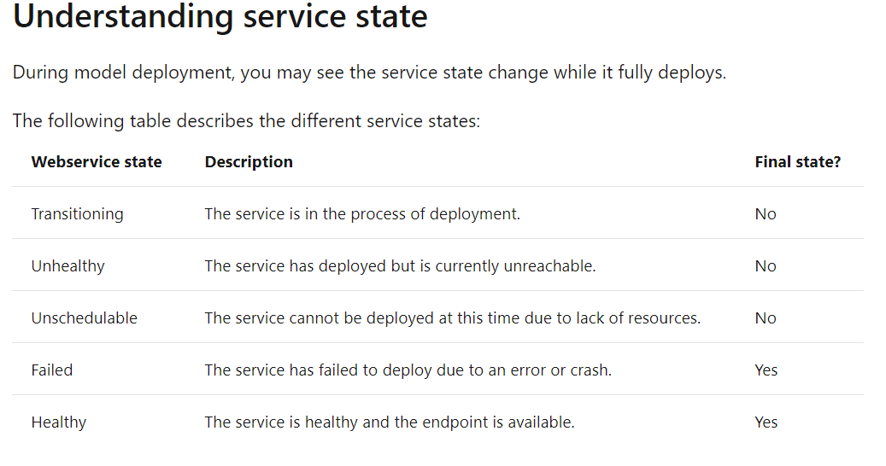

# Specs for different VirtualMachines
---
1. Virtual Machines (VMs): DCsv2-Series(Currently Available in **Southeast Asia**, Canada Central, Canada East, East US, South Central US, West US, West US 2, )
2. Azure Kubernetes (AKS): Orchestrate confidential containers
3. when creating compute target: Compute name can include letters, digits and dashes. It must start with a letter, end with a letter or digit, and be between 2 and 16 characters in length.
4. when deploying model, inference name must only consist of lowercase letters, numbers, or dashes, start with a letter, end with a letter or number, and be between 3 and 32 characters long.
5. when use the "upload_files" function, make sure the data path is a **LIST**
6. VERY IMPORTANT:use DSVM NOT VM！！！
7. what we need to install on a encrypted VM:  
   - first on website: https://docs.microsoft.com/en-us/azure/confidential-computing/quick-create-portal

8. An entry script, named score.py, loads the model when the deployed service starts. This script is also responsible for receiving data, passing it to the model, and then returning a response.
9. The entry script has only two required functions, **init()** and **run(data)**. These functions are used to initialize the service at startup and run the model using request data passed in by a client. The rest of the script handles loading and running the model(s).  

&#8194;&#8194;   

    

   
&#8194;&#8194;   